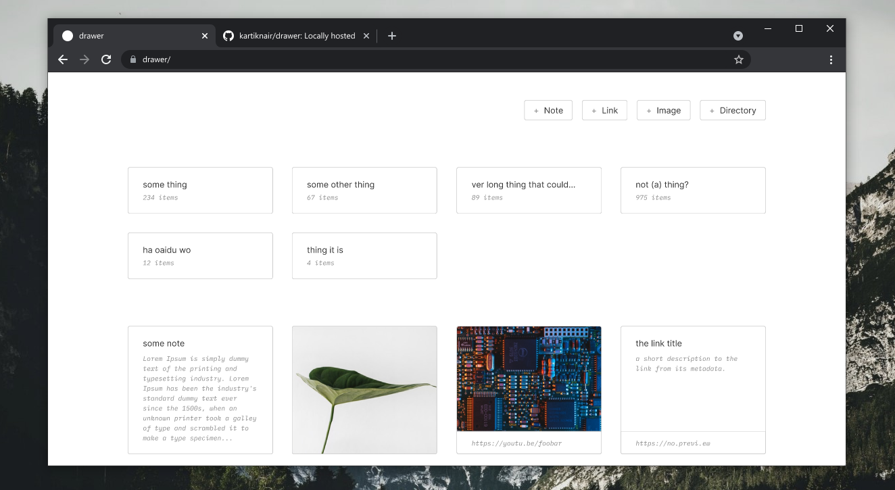

# drawer

A self-hosted application to organize your notes, images, & links.



## Getting Started

Drawer is a [Next.js](https://nextjs.org/) project bootstrapped with [`create-next-app`](https://github.com/vercel/next.js/tree/canary/packages/create-next-app).

To get your local version live you require Node.js and NPM installed on your system. If you have those, then you can start by cloning this repository:

```bash
git clone https://github.com/kartiknair/drawer
cd drawer
```

Then create a directory where drawer can store all the raw files. Copy this directories path into a `.env.local` file in the root of your cloned repository:

```bash
# in `.env.local`
STORAGE_DIRECTORY=/your/path/here
```

Now, you need to make sure that all dependencies are installed:

```bash
npm install
```

Once you do that, you can build and serve drawer locally:

```bash
npm run build
npm run start
```

Or if you would like to start drawer and have it running in the background:

```bash
# this builds drawer and serves it in a background server
npm run start-bg
```

## Development

To work on drawer it's the same process as before, but instead of building and serving, you instead start the dev server:

```bash
npm run dev
```
